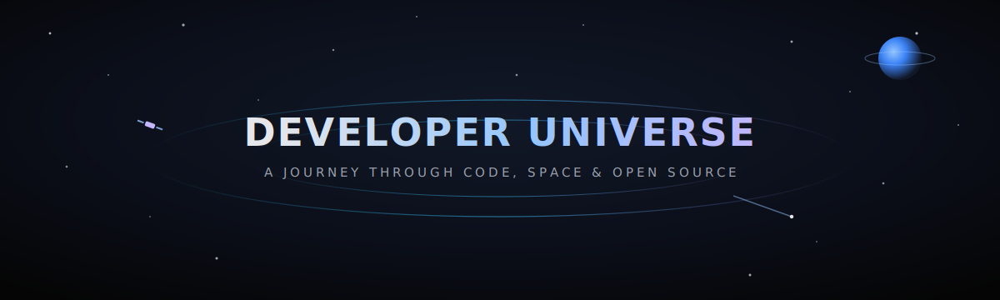
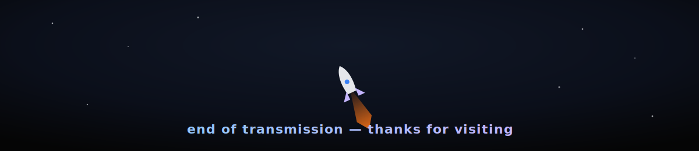

<div align="center">

</div>

<div align="center">


</div>


<!-- ============================================================ -->
<!--  MISSION CONTROL                                              -->
<!-- ============================================================ -->

<h2 align="center">🛰️ Mission Control</h2>
<p align="center"><i>Coordinates for the pilot behind this repository</i></p>

<table align="center">
<tr>
<td width="55%" valign="top">

```yaml
callsign     : Yash Raut
status       : Final-year B.E. Computer Engineering
institution  : University of Mumbai · 2024–2028
base         : Mumbai, India
core_stack   : MERN — React · Node · Express · SQL
current_op   : Self-taught transition into AI Engineering
directive    : Build in public. Teach what I learn.
```

</td>
<td width="45%" valign="top">

**Active build:** `Findly` — semantic search engine
**In transit:** `Docwise` — conversational PDF assistant
**Signal source:** LangChain · RAG · Vector DBs
**Open channel:** collabs, hackathons, OSS

</td>
</tr>
</table>


<!-- ============================================================ -->
<!--  SOURCE CODE GALAXY (tech stack)                              -->
<!-- ============================================================ -->

<h2 align="center">🌌 Source Code Galaxy</h2>
<p align="center"><i>Every star in this galaxy is a tool in active rotation</i></p>

<p align="center"><b>Languages</b></p>
<div align="center">

[](https://skillicons.dev)

</div>

<p align="center"><b>Frontend Constellation</b></p>
<div align="center">

[](https://skillicons.dev)

</div>

<p align="center"><b>Backend Core</b></p>
<div align="center">

[](https://skillicons.dev)

</div>

<p align="center"><b>Data Layer</b></p>
<div align="center">

[](https://skillicons.dev)

</div>

<p align="center"><b>AI Nebula</b></p>
<div align="center">

[](https://skillicons.dev)
&nbsp;


</div>

<p align="center"><b>Launch Infrastructure</b></p>
<div align="center">

[](https://skillicons.dev)

</div>


<!-- ============================================================ -->
<!--  OPEN SOURCE CONSTELLATION (projects, reframed)               -->
<!-- ============================================================ -->

<h2 align="center">✦ Open Source Constellation</h2>
<p align="center"><i>Six repositories, orbiting one roadmap</i></p>

<table align="center" width="100%">
<tr>
<td width="50%" valign="top">

**🔭 Findly**
Semantic search engine — hybrid retrieval
`FastAPI` `React` `ChromaDB` `YouTube API`
🟢 active — [repo](https://github.com/YashRaut24/Findly)

</td>
<td width="50%" valign="top">

**📄 Docwise**
Conversational PDF chatbot
`LangChain` `RAG` `Vector DB`
🟡 in transit — [repo](https://github.com/YashRaut24/Docwise)

</td>
</tr>
<tr>
<td width="50%" valign="top">

**🛰️ Scoutly**
_description pending_
⚪ pre-launch — [repo](#)

</td>
<td width="50%" valign="top">

**🪐 Nexus**
_description pending_
⚪ pre-launch — [repo](#)

</td>
</tr>
<tr>
<td width="50%" valign="top">

**⭐ Orion**
_description pending_
⚪ pre-launch — [repo](#)

</td>
<td width="50%" valign="top">

**🚀 Threadr** `flagship`
_description pending_
⚪ pre-launch — [repo](#)

</td>
</tr>
</table>


<!-- ============================================================ -->
<!--  GITHUB OBSERVATORY (stats)                                   -->
<!-- ============================================================ -->

<h2 align="center">🔭 GitHub Observatory</h2>
<p align="center"><i>Instruments reading the shape of the work so far</i></p>

<div align="center">


</div>

<div align="center">

</div>

<div align="center">

</div>


<!-- ============================================================ -->
<!--  ENERGY CORE (contribution / activity graph)                  -->
<!-- ============================================================ -->

<h2 align="center">⚡ Energy Core</h2>
<p align="center"><i>The reactor tracking daily commit output</i></p>

<div align="center">

</div>


<!-- ============================================================ -->
<!--  NEURAL TRANSMISSION (snake animation)                        -->
<!-- ============================================================ -->

<h2 align="center">🐍 Neural Transmission</h2>
<p align="center"><i>An energy stream tracing every contribution square</i></p>

<div align="center">

</div>

> This renders once the snake workflow (in the setup guide) runs for the first time.


<!-- ============================================================ -->
<!--  SYSTEM DIAGNOSTICS (progress log, reframed roadmap)          -->
<!-- ============================================================ -->

<h2 align="center">🧬 System Diagnostics</h2>
<p align="center"><i>A read-out of every module currently online</i></p>

<div align="center">

| Module | Diagnostic |
|:---|:---:|
| Python + Groq SDK | 🟢 online |
| Docker + CI/CD | 🟢 online |
| Embeddings + Transformers | 🟢 online |
| Vector Databases | 🟢 online |
| LangChain + RAG pipelines | 🟢 online |
| Six-project portfolio | 🟡 booting |
| Multi-agent systems | ⚪ queued |
| Production-scale deployment | ⚪ queued |

</div>


<!-- ============================================================ -->
<!--  DEEP SPACE SCANNER (fun facts)                               -->
<!-- ============================================================ -->

<h2 align="center">📡 Deep Space Scanner</h2>
<p align="center"><i>Anomalies detected while scanning this developer's orbit</i></p>

<div align="center">

🪐 100+ DSA problems solved and counting
🛠️ Shipped a full production site solo — React + SCSS
🚀 5 hackathons completed, including ISRO's BAH 2026
🌌 Runs on the belief that architecture is a decision paid for daily

</div>


<!-- ============================================================ -->
<!--  SATELLITE FEED (dynamic quote)                               -->
<!-- ============================================================ -->

<h2 align="center">📶 Satellite Feed</h2>
<p align="center"><i>A rotating transmission from the wider dev universe</i></p>

<div align="center">

</div>


<!-- ============================================================ -->
<!--  DIGITAL IDENTITY (connect)                                   -->
<!-- ============================================================ -->

<h2 align="center">🪪 Digital Identity</h2>
<p align="center"><i>Open frequencies for reaching this station</i></p>

<div align="center">

<a href="mailto:YOUR_EMAIL_HERE"></a>
<a href="https://linkedin.com/in/YOUR_LINKEDIN_HERE"></a>
<a href="https://github.com/YashRaut24"></a>

</div>


<!-- ============================================================ -->
<!--  END CREDITS                                                  -->
<!-- ============================================================ -->

<div align="center">

</div>