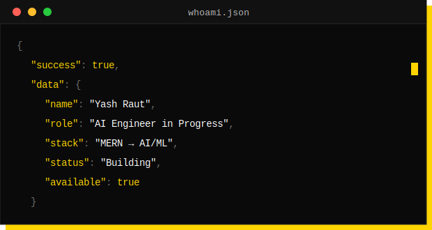
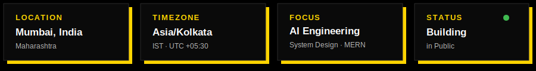
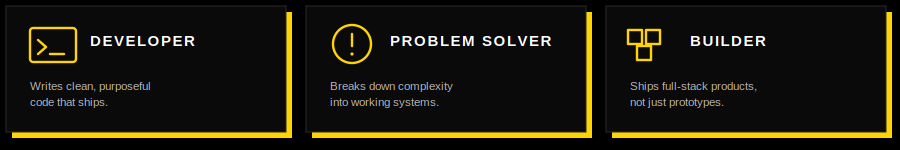

**Engineering software that is scalable, maintainable, and impactful.**

`Learn` • `Build` • `Repeat`

 

 

> I write code that solves problems, automates the boring stuff, and builds
> meaningful digital experiences — currently making the shift from full-stack
> MERN development into AI engineering.

 
 

 

## `//` Tech Stack

**Languages**

**Frontend**

**Backend**

**Databases**

**AI / ML**

**DevOps / Cloud**

**Tools**

 

## `//` GitHub Activity

 

<picture>
  <source media="(prefers-color-scheme: dark)" srcset="https://raw.githubusercontent.com/YashRaut24/YashRaut24/output/pacman-contribution-graph-dark.svg">
  <source media="(prefers-color-scheme: light)" srcset="https://raw.githubusercontent.com/YashRaut24/YashRaut24/output/pacman-contribution-graph.svg">
  
</picture>

 

## `//` Developer Philosophy

 

> *Programs must be written for people to read, and only incidentally for machines to execute.*

 

 

