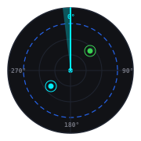

<!-- UNIFIED SPACE PORTAL PROFILE -->

<!-- SECTOR 07: live ORBITAL TRAFFIC sits in the pill (GitHub fetches Komarev on every profile view). -->
<table width="96%" cellpadding="0" cellspacing="0" border="0">
  <tr>
    <td bgcolor="#0B0C10" width="82%" valign="top">
      
      <table width="100%" cellpadding="6" cellspacing="0" border="0">
        <tr>
          <td bgcolor="#0B0C10" valign="middle">
            
          </td>
          <td bgcolor="#0B0C10" align="right" valign="middle" width="200">
            
          </td>
        </tr>
      </table>
    </td>
    <td bgcolor="#0B0C10" width="18%" align="center" valign="middle">
      
    </td>
  </tr>
</table>

<!-- ORBITAL FLIGHT DECK // DIRECT COMM-LINKS -->

<table width="85%">
  <tr>
    <td align="center" width="58%">
      
    </td>
    <td align="center" width="42%">
      
       
      
       
      
       
      
    </td>
  </tr>
</table>

