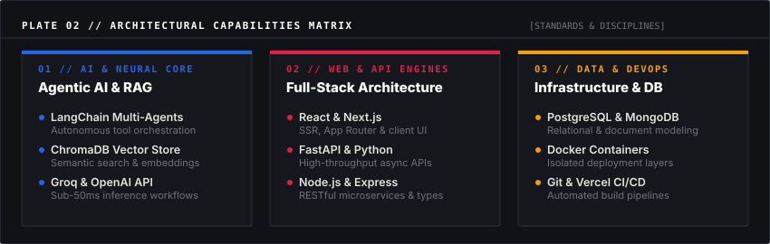
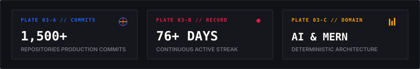

<!-- Minimalist Bauhaus Constructivist Hero with Kinetic 3D Wireframe Polyhedron -->

  

 

### `//` PLATE 02: ARCHITECTURAL CAPABILITIES MATRIX

 

### `//` PLATE 03: TELEMETRY &amp; REPOSITORY METRICS

 

 

