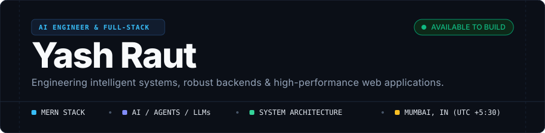
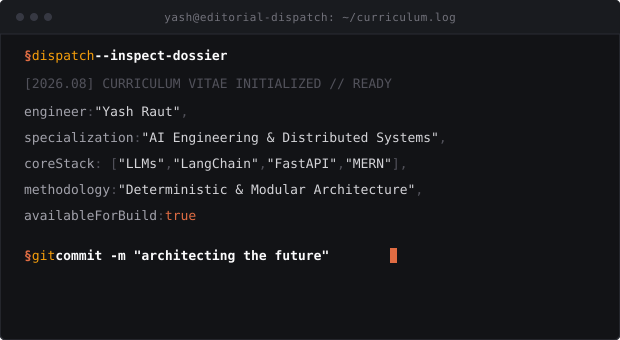
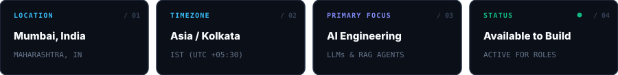
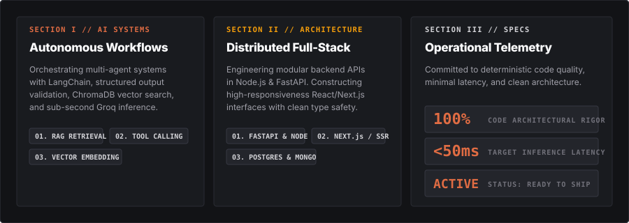
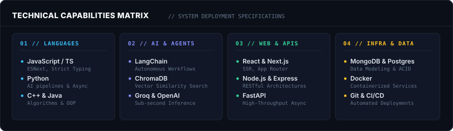
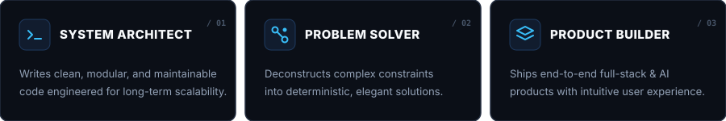

<div align="center">



[](https://github.com/YashRaut24)
[](https://www.linkedin.com/in/yash-raut-240505-yr30/)
[](mailto:yashdr2405@gmail.com)

</div>

<br/>



<div>
<br/>

> **Engineering software with architectural rigor and purpose.**
> 
> Full-stack engineer advancing into **AI systems, autonomous agents, and RAG architectures**. Dedicated to shipping deterministic, maintainable, and high-impact digital systems.

</div>

<br clear="left"/>
<br/>



<br/>

## `§ 01 // THE AI &amp; SYSTEM DOSSIER`



<br/>

## `§ 02 // TECHNICAL CAPABILITIES DIRECTORY`



<br/>

## `§ 03 // 3D ISOMETRIC CONTRIBUTION MATRIX`

Instead of flat contribution dots, activity is presented as an **Isometric 3D City Skyline** and an **Autonomous Snake Runner**.

<div align="center">

<picture>
  <source media="(prefers-color-scheme: dark)" srcset="https://raw.githubusercontent.com/YashRaut24/YashRaut24/main/profile-3d-contrib/profile-night-rainbow.svg">
  <source media="(prefers-color-scheme: light)" srcset="https://raw.githubusercontent.com/YashRaut24/YashRaut24/main/profile-3d-contrib/profile-green-animate.svg">
  
</picture>

<br/>

<picture>
  <source media="(prefers-color-scheme: dark)" srcset="https://raw.githubusercontent.com/YashRaut24/YashRaut24/output/github-contribution-grid-snake-dark.svg">
  <source media="(prefers-color-scheme: light)" srcset="https://raw.githubusercontent.com/YashRaut24/YashRaut24/output/github-contribution-grid-snake.svg">
  
</picture>

</div>

> **Note:** The 3D matrix and snake update automatically on scheduled actions. Full setup details in [`INSTALLATION.md`](./INSTALLATION.md).

<br/>

## `§ 04 // REPOSITORY ANALYTICS &amp; ACTIVITY`

<div align="center">


</div>

<br/>

## `§ 05 // CORE AXIOMS`



<br/>

## `§ 06 // PULL QUOTE`


<br/>

## `§ 07 // TELEMETRY LOGS (WAKATIME)`

<!--START_SECTION:waka-->
```text
Connecting telemetry... Activity syncs on scheduled workflow runs.
```
<!--END_SECTION:waka-->

Powered by [`anmol098/waka-readme-stats`](https://github.com/anmol098/waka-readme-stats) — config in [`.github/workflows/wakatime.yml`](./.github/workflows/wakatime.yml).

<br/>

<div align="center">


</div>

<br/>


