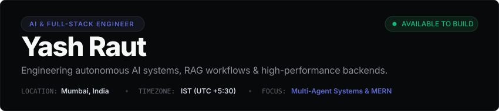
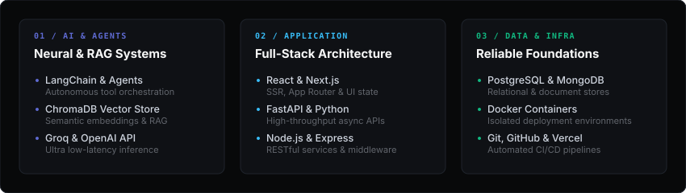

<div align="center">

<!-- Linear / Vercel Developer Hero -->


<br/><br/>

[](https://github.com/YashRaut24)
[](https://www.linkedin.com/in/yash-raut-240505-yr30/)
[](mailto:yashdr2405@gmail.com)

</div>

<br/>

### `//` Capabilities &amp; Architecture



<br/>

### `//` Contribution Activity

<div align="center">

<picture>
  <source media="(prefers-color-scheme: dark)" srcset="https://raw.githubusercontent.com/YashRaut24/YashRaut24/output/github-contribution-grid-snake-dark.svg">
  <source media="(prefers-color-scheme: light)" srcset="https://raw.githubusercontent.com/YashRaut24/YashRaut24/output/github-contribution-grid-snake.svg">
  
</picture>

</div>

<br/>

### `//` Repository Analytics

<div align="center">


</div>

<br/>

### `//` Telemetry

<!--START_SECTION:waka-->
```text
Connecting telemetry... Activity syncs on scheduled workflow runs.
```
<!--END_SECTION:waka-->

<br/>

<div align="center">


</div>
