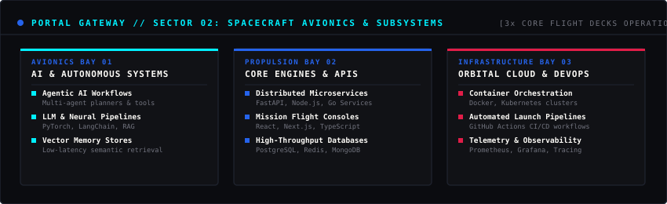
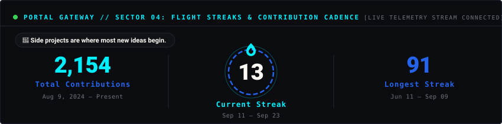
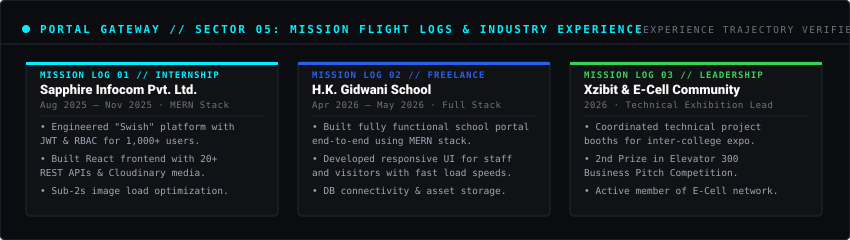
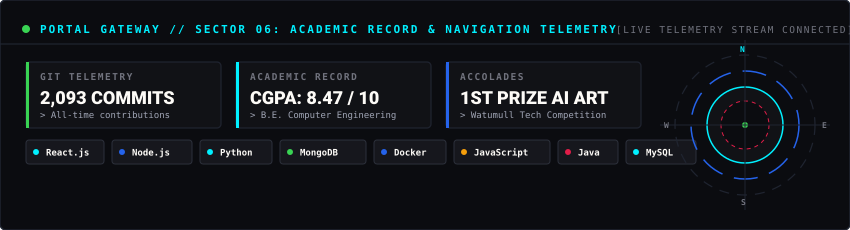
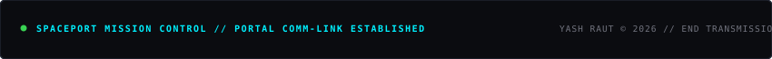

<!-- SECTOR 01: SPACE PORTAL MISSION COMMAND DECK -->

  

<!-- ORBITAL FLIGHT DECK // DIRECT COMM-LINKS -->

&nbsp;&nbsp;

  

&nbsp;&nbsp;

  

<!-- SECTOR 02: TECHNICAL STACK & CAPABILITIES -->

  

<!-- SECTOR 03: RETRO LASER CANNON COMMIT BLAST ARCADE -->

  

<!-- SECTOR 04: GITHUB CONTRIBUTIONS & STREAK CONSOLE -->

  

<!-- SECTOR 05: MISSION FLIGHT LOGS & INDUSTRY EXPERIENCE -->

  

<!-- SECTOR 06: ACADEMIC & MISSION TELEMETRY -->

  

<!-- ORBITAL VISITOR COUNTER -->

  

<!-- MISSION CONTROL DOCKING COLOPHON -->

